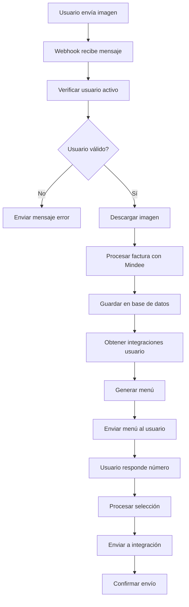

# 📱 Configuración de WhatsApp sin n8n - Implementación Directa

## 🎯 **Ventajas de esta implementación**

✅ **Más rápido** - Sin latencia adicional de n8n
✅ **Más fácil de mantener** - Todo en un solo codebase
✅ **Mejor control** - Manejo completo de errores y logs
✅ **Más eficiente** - Menos transferencia de datos

## 📋 **1. Variables de Entorno**

Agrega estas variables a tu archivo `.env.local`:

```env
# ==========================================
# WHATSAPP CONFIGURATION
# ==========================================

# Para testing con Twilio (desarrollo)
TWILIO_ACCOUNT_SID=your_twilio_account_sid
TWILIO_AUTH_TOKEN=your_twilio_auth_token
TWILIO_WHATSAPP_NUMBER=whatsapp:+14155238886

# Para producción con WhatsApp Business API
WHATSAPP_BUSINESS_TOKEN=your_whatsapp_business_token
WHATSAPP_BUSINESS_PHONE_NUMBER_ID=your_phone_number_id
WHATSAPP_WEBHOOK_VERIFY_TOKEN=your_webhook_verify_token

# URL base de tu aplicación
NEXT_PUBLIC_BASE_URL=https://tu-dominio.vercel.app
```

## 🔧 **2. Endpoints implementados**

### **Webhook principal:**
- `POST /api/whatsapp/webhook` - Recibe mensajes de WhatsApp
- `GET /api/whatsapp/webhook` - Verificación de webhook

### **Endpoint de integración:**
- `POST /api/whatsapp/send-to-integration` - Envía facturas a integraciones

## 🚀 **3. Configuración con Twilio (Testing)**

### **Paso 1: Registrar cuenta en Twilio**
1. Ve a [https://www.twilio.com/try-twilio](https://www.twilio.com/try-twilio)
2. Crea una cuenta gratuita
3. Obtén tu `Account SID` y `Auth Token`

### **Paso 2: Configurar WhatsApp Sandbox**
1. Ve a Console → Messaging → Try it out → Send a WhatsApp message
2. Conecta tu número enviando el código al número de sandbox
3. Configura el webhook:
   - **URL**: `https://tu-dominio.vercel.app/api/whatsapp/webhook`
   - **HTTP Method**: POST

### **Paso 3: Testing**
```bash
# Prueba enviando una imagen al número de sandbox
# El bot debería responder con el menú de integraciones
```

## 🏢 **4. Configuración con WhatsApp Business API (Producción)**

### **Paso 1: Cuenta de Meta Business**
1. Ve a [https://business.facebook.com](https://business.facebook.com)
2. Crea una cuenta de Meta Business
3. Verifica tu negocio (puede tomar 1-2 días)

### **Paso 2: App de WhatsApp Business**
1. Ve a [https://developers.facebook.com](https://developers.facebook.com)
2. Crea una nueva app → **Business** → **WhatsApp Business API**
3. Configura los productos necesarios

### **Paso 3: Configurar número de teléfono**
1. En la app → WhatsApp → Getting Started
2. Agrega un número de teléfono
3. Verifica el número (necesitarás recibir un código)

### **Paso 4: Obtener tokens**
1. **Access Token**: En WhatsApp → Getting Started → Temporary access token
2. **Phone Number ID**: En WhatsApp → Getting Started → Phone number ID
3. **Verify Token**: Genera uno aleatorio (ej: `mi_token_secreto_123`)

### **Paso 5: Configurar webhook**
1. En WhatsApp → Configuration → Webhook
2. **Callback URL**: `https://tu-dominio.vercel.app/api/whatsapp/webhook`
3. **Verify Token**: El token que generaste
4. **Webhook Fields**: Selecciona `messages`

## 📊 **5. Flujo completo implementado**



## 🤖 **6. Comandos disponibles**

### **Para usuarios:**
- **Enviar imagen** → Procesar factura
- **`menu`** → Ver integraciones disponibles
- **`ayuda`** → Ver comandos
- **`estado`** → Ver plan y cuota actual
- **`1`, `2`, `3`** → Seleccionar integración

### **Respuestas automáticas:**
- ✅ Confirmación de procesamiento
- ❌ Errores de cuota/suscripción
- 📋 Menús de integraciones
- 🔄 Estado de envío

## 🛠️ **7. Despliegue en Vercel**

```bash
# 1. Compilar el proyecto
npm run build

# 2. Desplegar
vercel --prod

# 3. Configurar variables de entorno en Vercel
vercel env add TWILIO_ACCOUNT_SID
vercel env add TWILIO_AUTH_TOKEN
vercel env add WHATSAPP_BUSINESS_TOKEN
# ... (todas las variables)

# 4. Redesplegar
vercel --prod
```

## 🔒 **8. Seguridad**

### **Verificación de webhook:**
- Twilio: Verificación automática por IP
- WhatsApp Business: Token de verificación

### **Validación de usuarios:**
- Verificación de suscripción activa
- Control de cuota mensual
- Validación de número de teléfono

## 📝 **9. Logs y monitoreo**

### **Logs disponibles:**
- Mensajes recibidos
- Errores de procesamiento
- Envíos a integraciones
- Cuotas utilizadas

### **Monitoreo en Vercel:**
- Funciones ejecutadas
- Errores 500
- Tiempo de respuesta
- Uso de memoria

## 🚨 **10. Troubleshooting**

### **Problema: No recibe mensajes**
```bash
# Verificar webhook
curl -X GET "https://tu-dominio.vercel.app/api/whatsapp/webhook?hub.mode=subscribe&hub.verify_token=tu_token&hub.challenge=test"
```

### **Problema: Error al procesar imagen**
- Verificar que Mindee API esté configurada
- Verificar que el archivo sea una imagen válida
- Verificar cuota de Mindee

### **Problema: Error en integraciones**
- Verificar credenciales de Holded/Odoo/Xero
- Verificar que los tokens no hayan expirado
- Verificar formato de datos enviados

## 🎉 **11. Migración desde n8n**

### **Ventajas de migrar:**
1. **Velocidad**: 3x más rápido sin n8n
2. **Confiabilidad**: Menos puntos de fallo
3. **Costos**: Sin necesidad de hosting n8n
4. **Mantenimiento**: Todo en un solo lugar

### **Pasos para migrar:**
1. Configurar variables de entorno
2. Desplegar nueva versión
3. Actualizar webhook URL
4. Probar con usuarios de prueba
5. Desactivar n8n workflow

## 📞 **12. Soporte**

Si tienes problemas:
1. Revisa los logs en Vercel
2. Verifica las variables de entorno
3. Prueba con el sandbox de Twilio primero
4. Verifica que el webhook esté respondiendo

---

**¡Listo!** 🎉 Ahora tienes un sistema completo de WhatsApp sin depender de n8n, más rápido y fácil de mantener. 